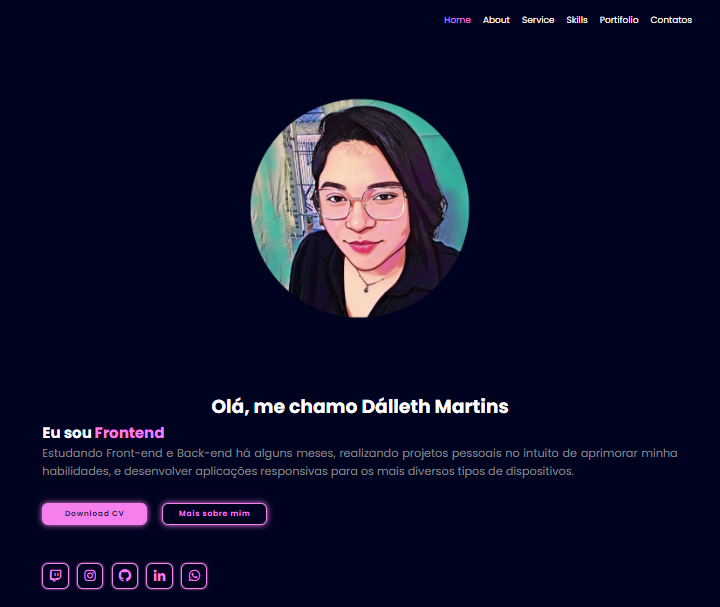
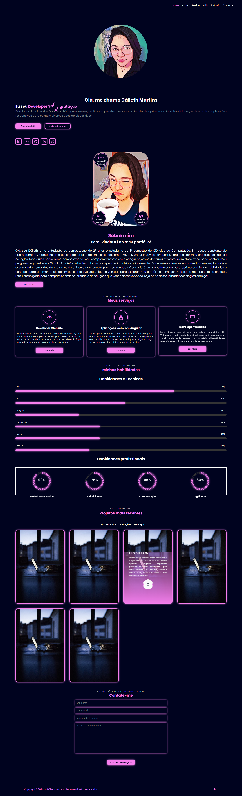

# Portifólio Pessoal

Bem-vindo ao meu Portfólio Pessoal! Este projeto foi desenvolvido para exibir uma coleção dos meus trabalhos mais recentes e destacar minhas habilidades em desenvolvimento web.

## 👀 Visualização
[Link para a Visualização](https://dalleth-martinss.github.io/personal-portfolio)

## Índice

- <a href="#funcionalidades"> Funcionalidades </a>
- <a href="#layout">Layout</a>
- <a href="#demonstração">Demonstração</a>
- <a href="#visualização">Visualização</a>
- <a href="#autora"> Autora</a>
- <a href="#license"> License</a>

## 📲 Funcionalidades do portifólio

- [x] O portfólio exibe uma coleção dos meus projetos, com detalhes e links para visualização.
- [x] Animações
- [x] Todos os componentes do portfólio foram desenvolvidos com design responsivo, garantindo uma experiência consistente em diferentes dispositivos e tamanhos de tela.
- [x] A navegação pelo portfólio é intuitiva e suave, proporcionando uma experiência agradável para o usuário.

## 📑Layout

- [x] Introdução sobre mim
- [x] Meus serviços
- [x] Minhas habilidades
- [x] Projetos
- [x] Contate-me

## 👩🏻‍💻 Demonstração

## Autoura 
E. Dálleth S. Martins

## Lincese 
[MIT License](https://opensource.org/licenses/MIT)

Copyright (c) [2024] [E. Dálleth S. Martins]

Permissão é concedida, gratuitamente, a qualquer pessoa que obtenha uma cópia deste software e dos arquivos de documentação associados (o "Software"), para lidar com o Software sem restrição, incluindo, sem limitação, os direitos de usar, copiar, modificar, mesclar, publicar, distribuir, sublicenciar e/ou vender cópias do Software, e permitir que as pessoas a quem o Software é fornecido o façam, sujeitas às seguintes condições:

O aviso de direitos autorais acima e este aviso de permissão devem ser incluídos em todas as cópias ou partes substanciais do Software.

O SOFTWARE É FORNECIDO "COMO ESTÁ", SEM GARANTIA DE QUALQUER TIPO, EXPRESSA OU IMPLÍCITA, INCLUINDO, MAS NÃO SE LIMITANDO ÀS GARANTIAS DE COMERCIALIZAÇÃO, ADEQUAÇÃO A UM FIM ESPECÍFICO E NÃO VIOLAÇÃO. EM NENHUM CASO OS AUTORES OU TITULARES DE DIREITOS AUTORAIS SERÃO RESPONSÁVEIS POR QUALQUER RECLAMAÇÃO, DANOS OU OUTRA RESPONSABILIDADE, SEJA EM AÇÃO DE CONTRATO, TORT OU OUTRA FORMA, DECORRENTE DE, FORA DE OU EM CONEXÃO COM O SOFTWARE OU O USO OU OUTRAS NEGOCIAÇÕES NO SOFTWARE.

